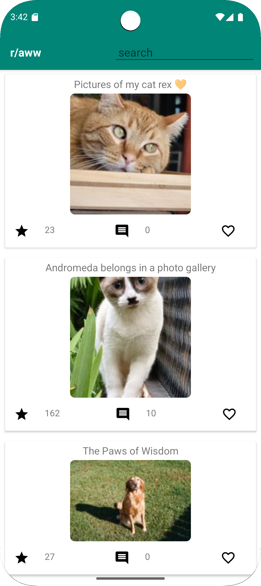
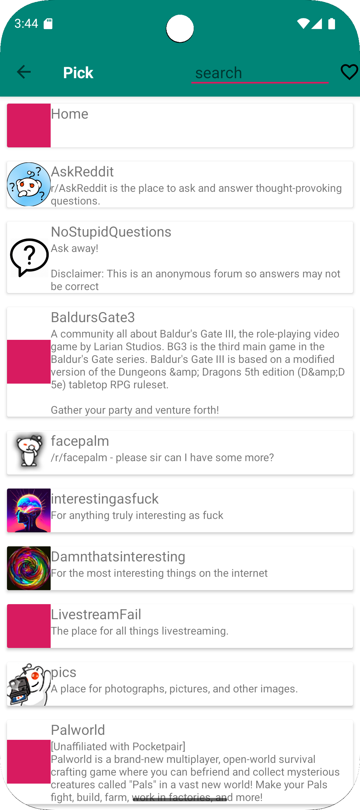
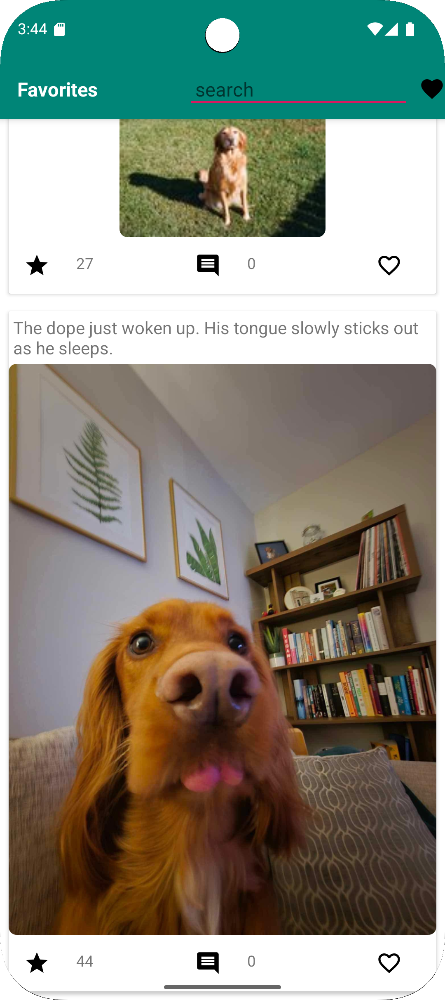
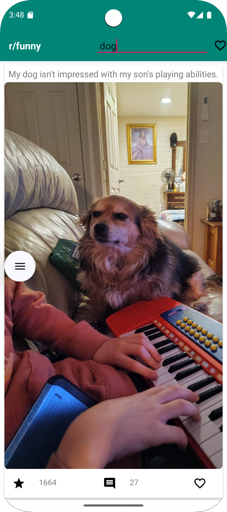

# Reddit Lite - Android App for Browsing & Favoriting Reddit Posts

## Project Overview
Reddit Lite is an Android application that allows users to browse, search, and favorite posts from various subreddits using the Reddit API. The app provides a seamless experience with smooth navigation between subreddit feeds, individual posts, and a dedicated favorites section.

## Features
- Search Functionality: Users can search for subreddits and posts.
- Favorite Posts: Mark posts as favorites and view them in a separate section.
- Pull to Refresh: Refresh subreddit content with a swipe gesture.
- Post Details View: Click on a post to view the full content, including text and images.
- SpannableString Support: Highlights search terms dynamically.
- LiveData & ViewModel Architecture: Ensures reactive UI updates.

## Tech Stack
- Kotlin
- Android Jetpack Components (LiveData, ViewModel, Navigation)
- Retrofit (for API calls)
- Glide (for image loading)
- RecyclerView (for efficient post listing)

## Screenshots
| Posts | Subreddit | Favorites | Search |
|-----------|----------|-----------|----------|
|  |  |  |  |

## Installation & Setup
1. Clone the repository:
   ```sh
   https://github.com/minmin619/Android_app_for_Reddit.git
